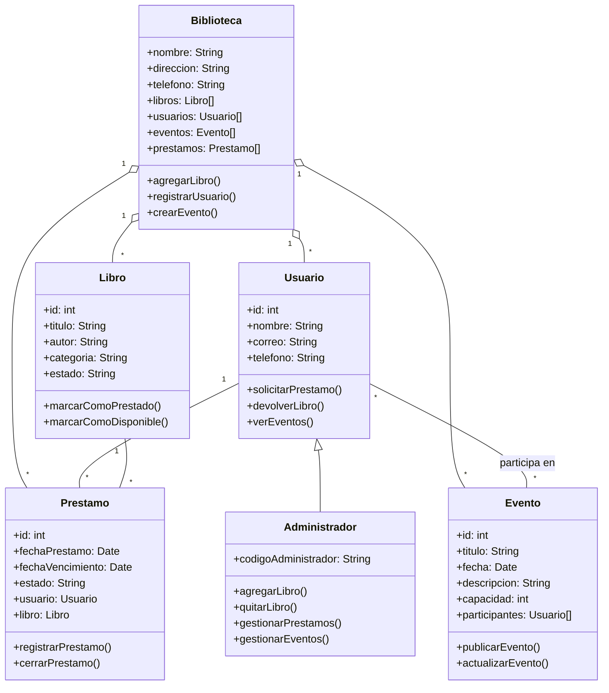

# Diagrama de Clases - Biblioteca Popular Pueyrredon Norte

Este diagrama es una version simple y de analisis para usar como guia inicial del proyecto.

## Relaciones principales

- `Administrador` hereda de `Usuario`.
- `Biblioteca` administra libros, usuarios, eventos y prestamos.
- `Usuario` puede tener varios prestamos.
- `Libro` puede participar en varios prestamos a lo largo del tiempo.
- `Usuario` puede participar de distintos eventos de la biblioteca.

