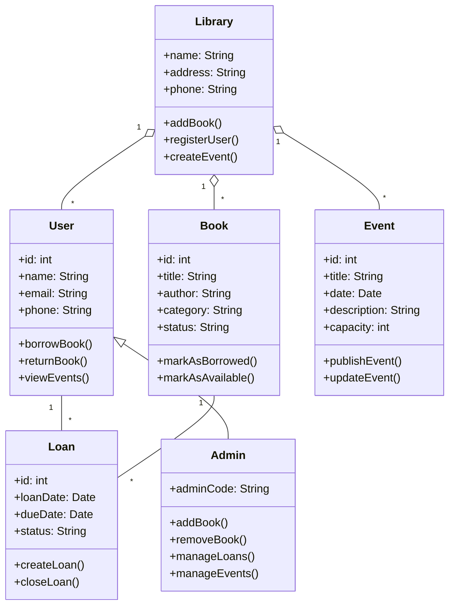

# Diagrama de Clases - Biblioteca Popular Pueyrredon Norte

Este diagrama es una version simple y de analisis para usar como guia inicial del proyecto.

## Relaciones principales

- `Admin` hereda de `User`.
- `Library` administra libros, usuarios y eventos.
- `User` puede tener varios prestamos.
- `Book` puede participar en varios prestamos a lo largo del tiempo.
- `Event` es abierto a cualquier usuario del sistema.

